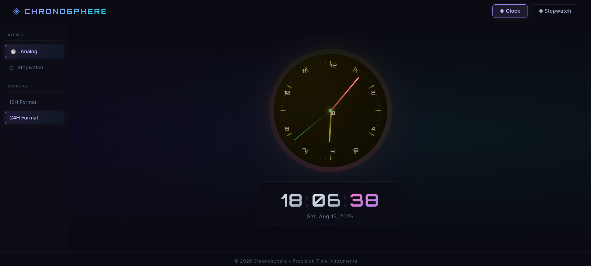

# Chronosphere Analog Clock

A cyberpunk themed time app built with React.

Features:
- Smooth analog clock with animated hands
- Digital clock with 12-hour and 24-hour modes
- Stopwatch with lap tracking
- Responsive UI for desktop and mobile

## Tech Stack

- React (Create React App)
- JavaScript
- CSS

## Project Screenshot



Add your screenshot image file at this path:
- screenshots/chronosphere.png

## Requirements

- Node.js (recommended: 18 LTS or newer)
- npm (comes with Node.js)

## Run Locally

1. Open terminal in this folder.
2. Install dependencies:

```bash
npm install
```

3. Start development server:

```bash
npm start
```

4. Open in browser:

http://localhost:3000

## Build for Production

```bash
npm run build
```

This generates the production files in the build folder.

## Scripts

- npm start: Run development server
- npm run build: Create production build
- npm test: Run tests

## GitHub Upload Notes

Push these:
- src
- public
- package.json
- package-lock.json
- .gitignore
- README.md

Do not push:
- node_modules
- build
